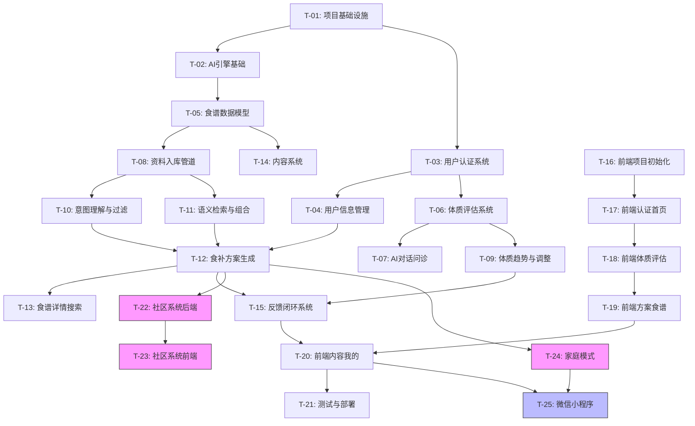

# 中医食补应用 — 全局执行计划概览

> 版本：v1.1（对齐 AGENTS.md v2）
> 日期：2026-05-29
> 状态：待确认
> 对应结果蓝图：`agent-doc/result-first/project-final-state.md`
> 依据规则：`.opencode/AGENTS.md`「计划驱动」原则 — 计划必须拆分为独立子计划文件，每个文件从结果蓝图直引最终结果

---

## 1. 计划概览

| 指标 | 值 |
|------|-----|
| 任务总数 | 21（一期18 + 二期3） |
| 子计划总数 | 21（每个任务对应一个子计划文件） |
| 阶段划分 | 基础设施 → 数据层 → 后端引擎 → 后端业务 → 前端 → 集成测试 → 部署 |
| 一期预估工时 | ~150 小时 |

---

## 2. 任务依赖图

> 粉色 = 二期任务，蓝色 = 可选任务，无色 = 一期核心

---

## 3. 任务清单

| 编号 | 任务名称 | 前置依赖 | 对应结果蓝图章节 | 负责Agent | 优先级 | 子计划文件 | 预估工时 |
|------|---------|---------|----------------|-----------|--------|-----------|---------|
| T-01 | 项目基础设施搭建 | 无 | 技术架构/部署 | PM/DevOps | Must | SP-01 | 4h |
| T-02 | AI 引擎基础设施 | T-01 | 技术选型/AI引擎层 | 后端Dev | Must | SP-02 | 5h |
| T-03 | 用户认证系统 | T-01 | 后端API-认证鉴权 | 后端Dev | Must | SP-03 | 5h |
| T-04 | 用户信息与禁忌管理 | T-03 | 后端API-用户服务/数据表-users | 后端Dev | Must | SP-04 | 3h |
| T-05 | 食谱与知识库数据模型 | T-01 | 数据表-recipes/knowledge_chunks | 后端Dev | Must | SP-05 | 4h |
| T-06 | 体质评估系统（问卷） | T-03 | 后端API-体质评估/评分算法 | 后端Dev | Must | SP-06 | 6h |
| T-07 | AI 对话问诊 | T-02+T-06 | 后端API-对话评估/SSE | 后端Dev | Must | SP-07 | 4h |
| T-08 | 资料入库管道 | T-02+T-05 | 后端API-检索引擎/入库 | 后端Dev | Must | SP-08 | 6h |
| T-09 | 体质趋势与动态调整 | T-06+T-15 | 后端API-趋势/AI调整 | 后端Dev | Should | SP-09 | 3h |
| T-10 | 意图理解与元数据过滤 | T-02+T-08 | AI引擎-意图理解/元数据过滤 | 后端Dev | Must | SP-10 | 5h |
| T-11 | 语义检索与组合引擎 | T-02+T-08 | AI引擎-语义检索/组合引擎 | 后端Dev | Must | SP-11 | 7h |
| T-12 | 食补方案生成与替换 | T-04+T-10+T-11 | 后端API-食补方案 | 后端Dev | Must | SP-12 | 7h |
| T-13 | 食谱详情与搜索 | T-08 | 后端API-食谱/搜索 | 后端Dev | Should | SP-13 | 3h |
| T-14 | 内容系统 | T-05 | 后端API-内容服务 | 后端Dev | Should | SP-14 | 3h |
| T-15 | 反馈闭环系统 | T-02+T-12 | 后端API-反馈/权重 | 后端Dev | Must | SP-15 | 6h |
| T-16 | 前端项目初始化 | 无 | 前端-所有页面 | 前端Dev | Must | SP-16 | 4h |
| T-17 | 前端认证与首页 | T-03+T-16 | 前端-登录/引导/首页 | 前端Dev | Must | SP-17 | 8h |
| T-18 | 前端体质评估页面 | T-06+T-07+T-16 | 前端-评估(问卷/对话/报告) | 前端Dev | Must | SP-18 | 6h |
| T-19 | 前端方案与食谱页面 | T-12+T-13+T-16 | 前端-方案/食谱 | 前端Dev | Must | SP-19 | 10h |
| T-20 | 前端内容与我的页面 | T-04+T-14+T-15+T-16 | 前端-内容/我的/设置 | 前端Dev | Must | SP-20 | 8h |
| T-21 | 自动化测试 | T-01~T-20 | 非功能终态-质量 | 测试 | Must | SP-21 | 14h |
| T-22 | CI/CD 与部署 | T-01~T-21 | 非功能终态-部署 | DevOps | Must | SP-22 | 5h |
| T-23 | 社区系统后端 | T-12 | 后端API-社区/数据表-社区 | 后端Dev | Could | SP-23 | 8h |
| T-24 | 社区系统前端 | T-17+T-23 | 前端-社区页面 | 前端Dev | Could | SP-24 | 6h |
| T-25 | 家庭模式 | T-12+T-20 | 后端+前端-家庭 | 后端+前端 | Could | SP-25 | 6h |
| T-26 | 管理后台 | T-08+T-14+T-23 | 后端API-管理后台 | 后端Dev | Could | SP-26 | 5h |
| T-27 | 微信小程序 | T-17~T-20 | 前端-小程序 | 前端Dev | Should | SP-27 | 16h |

---

## 4. 关键里程碑

| 里程碑 | 条件 | 涉及任务 | 预估达成 |
|--------|------|---------|---------|
| M1: 基础设施就绪 | T-01~T-02 完成 | T-01, T-02 | Day 1 |
| M2: 后端核心能力 | T-03~T-12 完成（可生成方案） | T-03~T-12 | Day 5 |
| M3: 后端全功能 | T-13~T-15 完成 | T-13~T-15 | Day 7 |
| M4: 前端 MVP | T-16~T-20 完成（全流程可走通） | T-16~T-20 | Day 12 |
| M5: 发布就绪 | T-21~T-22 完成 | T-21, T-22 | Day 15 |
| M6: 小程序上线（可选） | T-27 完成 | T-27 | Day 20 |

---

## 5. 二期任务（当前不执行）

| 编号 | 任务 | 触发条件 |
|------|------|---------|
| T-23 | 社区系统后端 | 一期发布后，用户确认启动社区功能 |
| T-24 | 社区系统前端 | T-23 完成后 |
| T-25 | 家庭模式 | 社区功能上线后 |
| T-26 | 管理后台 | 视运营需要启动 |

---

## 5. 验证机制

每个子计划执行完成后，必须产出验证报告：

| 验证类型 | 产出文件 | 说明 |
|---------|---------|------|
| 覆盖核查 | `plan/2026-05-29/verification-coverage-report.md` | 全局检查：所有 SP 是否完整覆盖结果蓝图所有章节 |
| 逐项验证 | `plan/2026-05-29/verification-sp-XX-report.md` | 每个 SP 执行完后，逐项比对验收标准与结果蓝图 |

验证依据：`.opencode/AGENTS.md`「结果蓝图完整性」原则 — 结果蓝图必须被完整覆盖，不能有一丝缺漏。

---

## 6. 任务与结果蓝图覆盖矩阵

| 结果蓝图章节 | 覆盖任务 |
|-------------|---------|
| 1. 前端页面清单 | T-16~T-20, T-24, T-27 |
| 1.3 线框图 | T-17~T-20 |
| 2.2 API 清单 | T-03~T-15, T-23, T-26 |
| 2.3 调用链路 | T-06, T-07, T-12, T-15, T-23, T-25 |
| 3.2 数据库表 | T-03~T-06, T-08, T-14, T-15, T-23, T-25 |
| 3.3 数据流 | T-08, T-12, T-15 |
| 4.2 业务规则 | 所有后端任务 |
| 4.3 维度体系 | T-05, T-08, T-11, T-14 |
| 5. 质量属性 | T-21, T-22 |
| 6. 部署 | T-22 |
